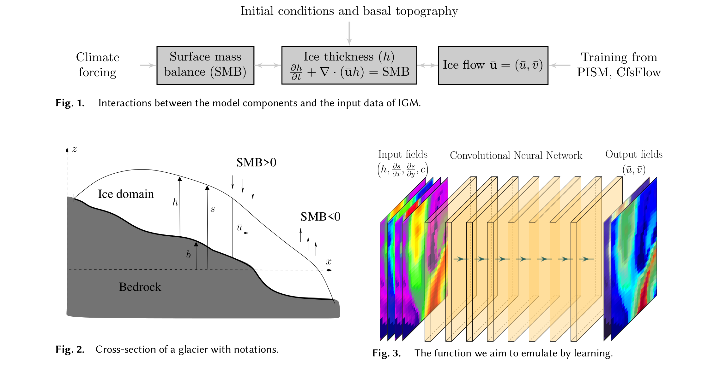

### <h1 align="center" id="title">The Instructed Glacier Model (IGM)</h1>

# Notice 

IGM is a very young code, which has been shortly distributed after the publication of our [paper](https://www.doi.org/10.1017/jog.2021.120) in Journal of Glaciology. More features will come in the next months (e.g., data assimilation). IGM is in a preliminary phase, which aims to illustrate its capacities with simple examples and get feedback from the community. If you have ideas of extensions or applications, you would like to contribute, please contact me at guillaume.jouvet at unil.ch.

# Overview   

The Instructed Glacier Model (IGM) simulates the ice dynamics, surface mass balance, and its coupling through mass conservation to predict the evolution of glaciers, icefields, or ice sheets (Figs. 1 and 2). 

The specificity of IGM is that it models the ice flow by a Convolutional Neural Network (CNN), which is trained with state-of-the-art ice flow models (Fig. 3). By doing so, the most computationally demanding model component is substituted by a cheap emulator, permitting speed-up of several orders of magnitude at the cost of a minor loss in accuracy.

IGM consists of an open-source Python code, which runs across both CPU and GPU and deals with two-dimensional gridded input and output data. Together with a companion library of ice flow emulators, IGM permits user-friendly, highly efficient, and mechanically state-of-the-art glacier simulations.
    
# Manual / Wiki

IGM's documentation is in construction in the [wiki](https://github.com/jouvetg/igm/wiki)

# Quick start

The easiest and quickest way is to get to know IGM is to run notebooks in , which offers free access to GPU. 

# IGM related Master and PhD project offers

I'm currently seeking for students (at Master or PhD level) to develop IGM. If you are interested, just get in touch with me.

# Contact

Feel free to drop me an email for any questions, bug reports, or ideas of model extension: guillaume.jouvet at unil.ch

